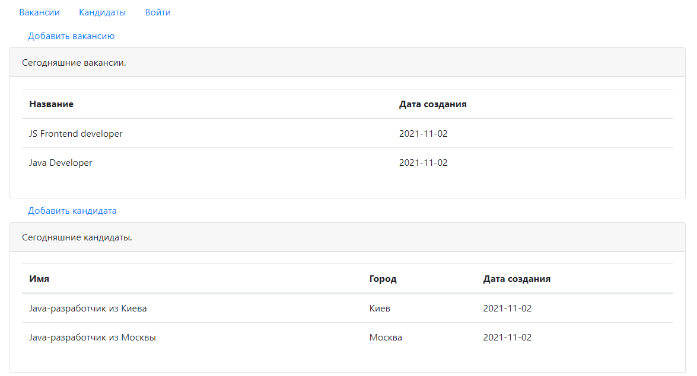
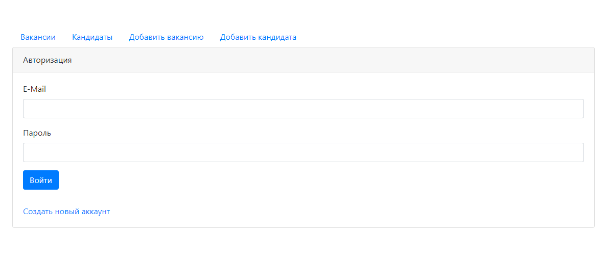
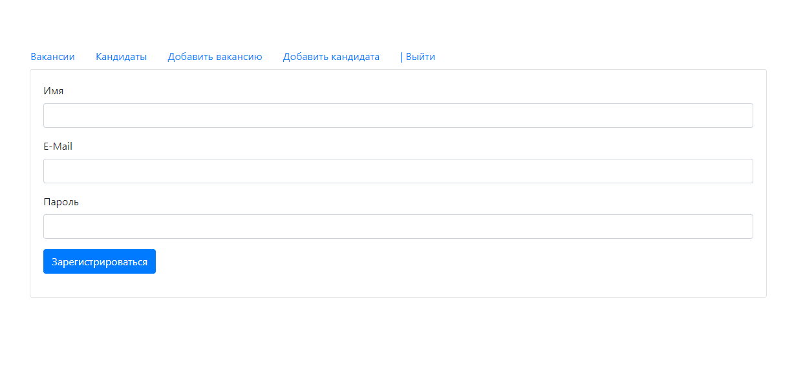
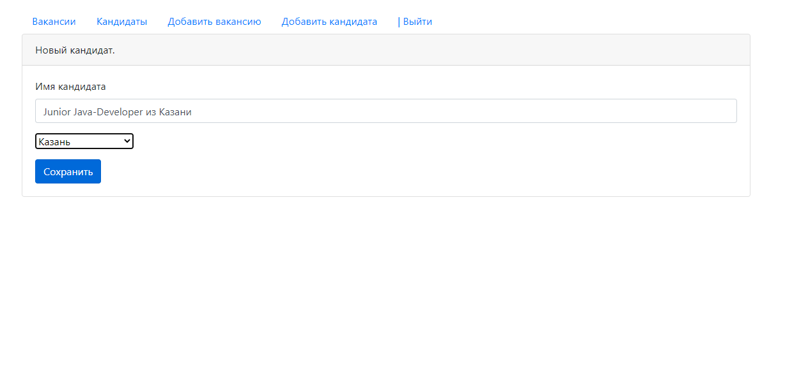
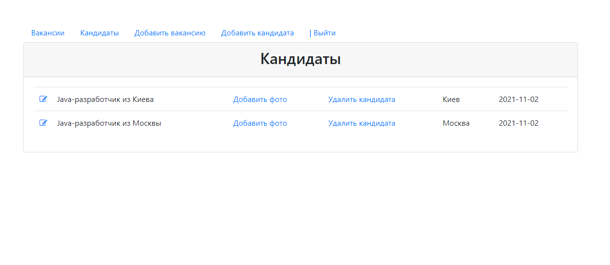

Dream Job (Работа мечт) - биржа работы.

В системе присутствуют два вида пользователей: кандидаты и кадровики

◉Кандидаты могут публиковать своё резюме и откликнуться на вакансию.

◉Кадровики могут публиковать вакансии о работе и пригласить на вакансию кандидата.

Использоване при разработке технологии:

◉ Java Servlet
◉ PostgreSQL
◉ JDBC
◉ Apache Tomcat
◉ JSP/JSTL
◉ Log4j
◉ Travis CI
◉ Maven

